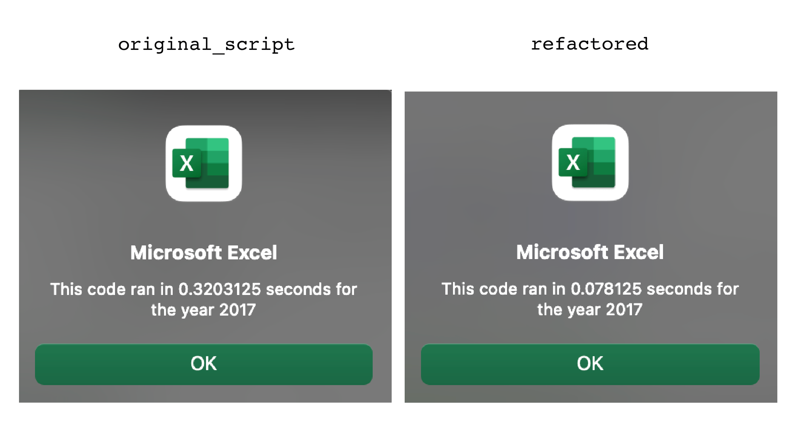

# STOCK_ANALYSIS

## OVERVIEW

The purpose of this project is to help our client in his research of the stock market by producing code 
that processes all stocks listed on the market. To accomplish this we have to refactor the initial code 
we composed for him when his research was focused on an initial number of 12 stocks, making sure the 
code runs as fast as possible.

## RESULTS 

The key element in our refactored code is the  variable ```tickerIndex```. By declaring this variable 
we can dispose of the nested loop that we had to use in the original script. 

```
Dim tickerIndex As Single
    tickerIndex = 0
```
The ticker index allows us to calculate volumes 
without the need of a conditional within the loop.

```tickerVolumes(tickerIndex) = tickerVolumes(tickerIndex) + Cells(i, 8).Value```

Our refactored loop ran in 0.0703125 seconds for 2018 in contrast to 0.3359375 seconds of the original script runtime. 
Similarly for 2017 the refactored code took  0.078125 seconds to run instead of 0.3203125. **The refactored code ran approximately 25% faster.** 

 
