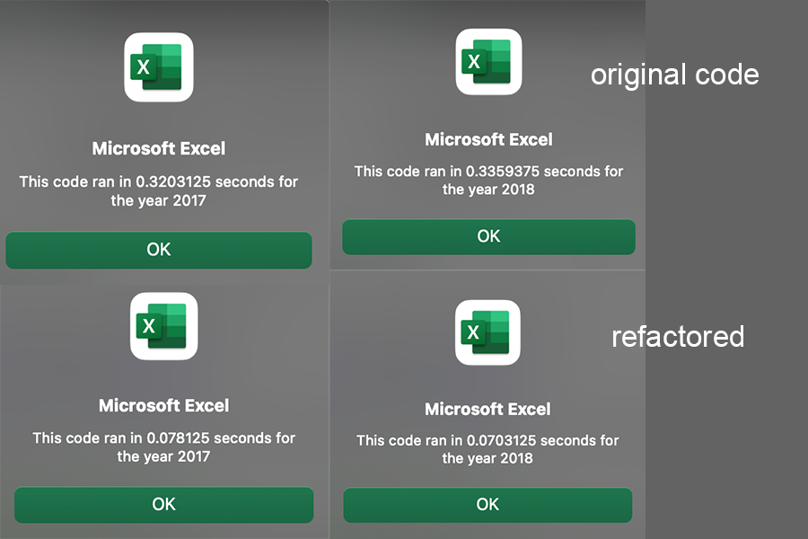

# STOCK_ANALYSIS

## OVERVIEW

 The purpose of this project is to help our client in his research of the stock market by producing code 
that processes all stocks listed on the market. To accomplish this we have to refactor the initial code 
we composed for him when his research was focused on an initial number of 12 stocks, making sure the 
code runs as fast as possible.

## RESULTS 

### Refactoring the Original Code.

 The key element in our refactored code is the  variable ```tickerIndex```. By declaring this variable 
we can dispose of the nested loop that we had to use in the original script. 

```
Dim tickerIndex As Single
    tickerIndex = 0
```
 The ticker index allows us to calculate volumes 
without the need of a conditional within the loop.

```tickerVolumes(tickerIndex) = tickerVolumes(tickerIndex) + Cells(i, 8).Value```

 Our refactored loop ran in 0.0703125 seconds for 2018 in contrast to 0.3359375 seconds of the original script runtime. 
Similarly for 2017 the refactored code took  0.078125 seconds to run instead of 0.3203125. **The refactored code ran approximately 25% faster.** 


 
 ### Stock Performance
 
 The image of 2018 has the potential to create panic for the state of the market - though some may say it is an opportunity. Yet if we combine 2018 to the previous year we will see that this is not the case. JKS and SPWR and TERP are the only stocks that have negative returns in the 24 month range. All the other stocks have performed either favorably or very favorably. 
 


 The two stocks that stand out are naturally the stocks that show gains for both years. ENPH has risen by 211.4% in 24 months and RUN has climbed 89,5%. Both stocks have icreased their daily volumes in 2018. ENPH had in fact the highest daily volume in 2018 rising by 275% compared to the year before while RUN had a matching performance of 187%  .Although there was a slight increase in Total Daily Volumes accross the board in 2018 by around 6% compared to the previous year some stocks lost or gained volume disproportionately. This might serve as a forecast of higher volatility for these stocks. 
 
## SUMMARY 
 
 Refactoring a code is a refining art. There is always an opportunity for improvement. This improvement most of the times is a turn to simplicity. The simpler the code is the faster the code is to run, to read and to refactor. Refactoring also means a code can find its way to the hands of hundreds of different individuals with different thinking processess different degrees of practicality and evolve in a way its creator did not imagine. I feel coding is ultimately a team sport. Refactoring is defending and passing the ball in front to attack in a more effective way. 
 
 
 Refactoring in VBA is extremely important as the coexistance computational mathematical
